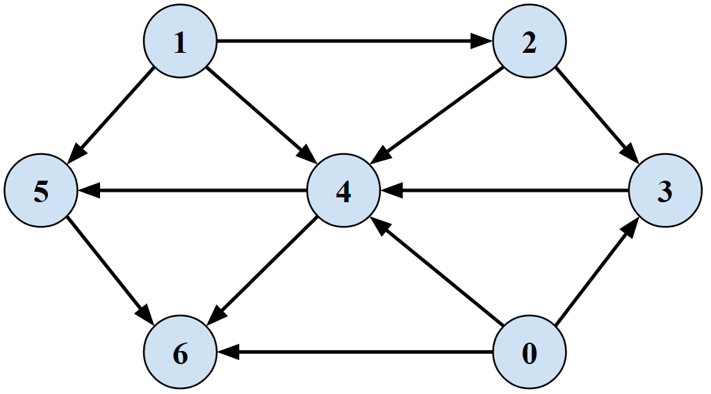
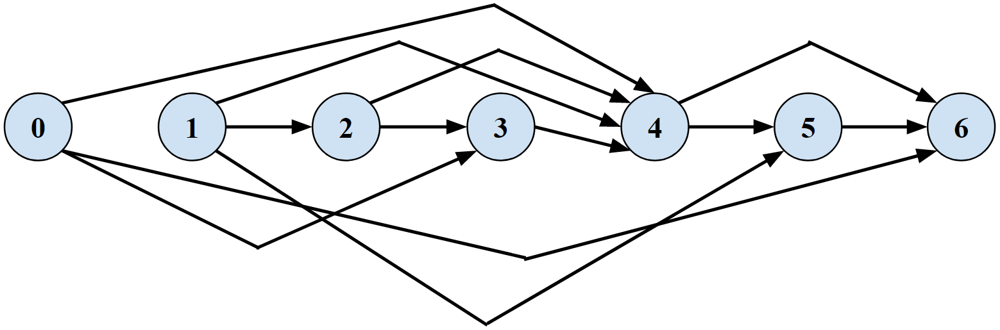
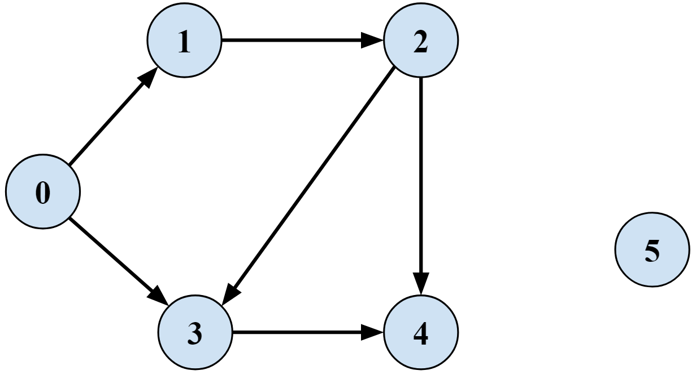
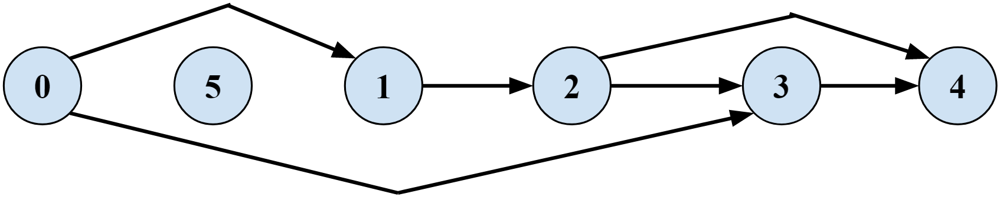
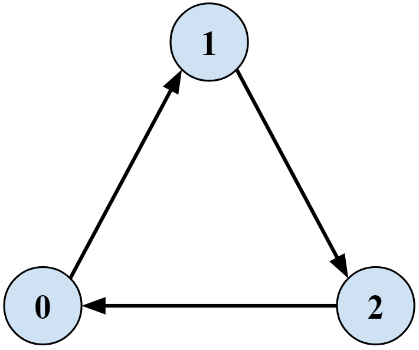

# Topological Ordering
Finds a Topological Ordering of vertices in a Directed Acyclic Graph

## Problem Statement
**Topological Ordering:** arranges nodes as v1, v2 ..., vn so that for every edge (vi, vj) we have i < j
- Must be a Directed Graph
- Must NOT contain a cycle

### Graph 1

### Graph 1 Topological Ordering

## Algorithm
A DAG must have a node with **no incoming edges**  
Pick a node `v` with no incoming edges  
Print `v`  
Calculate a topological ordering on G–{`v`}  
Ends when all nodes are visited and all included in the ordering

Keep track of 2 things:
- `count(w)` = number of incoming edges
- `S` = set of nodes with no incoming edges

Set-Up
- Scan through the graph to initialize `count[]` and `S`
- **O(m + n)**

Finding the Ordering
- Remove v from S
- Decrement `count[w]` for all edges from `v` to` w`  
add `w` to `S` if `count[w]` hits `0`
- **O(1) per edge**

## Runtime
**O(m + n)**

## Usage
- **Detects cycles if graph is not a DAG and prints an error message**
- Create a graph as an adjacency list  
`ArrayList<ArrayList<Integer>> graph1 = new ArrayList<ArrayList<Integer>>();`
- Add rows for each vertex. `graph1.get(u)` is a list of nodes representing edges FROM `u`
- Run `TopologicalOrdering.findTopologicalOrdering(graph1);`

### Graph 2

### Graph 2 Topological Ordering

### Graph 3 (No topological ordering)

Contains a cycle, & no nodes with no incoming edges

### Graph 4 (No topological ordering)

Contains a cycle

## References
- [Kevin Wayne Slides](https://www.cs.princeton.edu/~wayne/kleinberg-tardos/pdf/03Graphs.pdf#page=45)
- [University of Washington slides](https://homes.cs.washington.edu/~jrl/421slides/lec5.pdf)
- [Rajesh Rao Slides](https://courses.cs.washington.edu/courses/cse326/03wi/lectures/RaoLect20.pdf)
